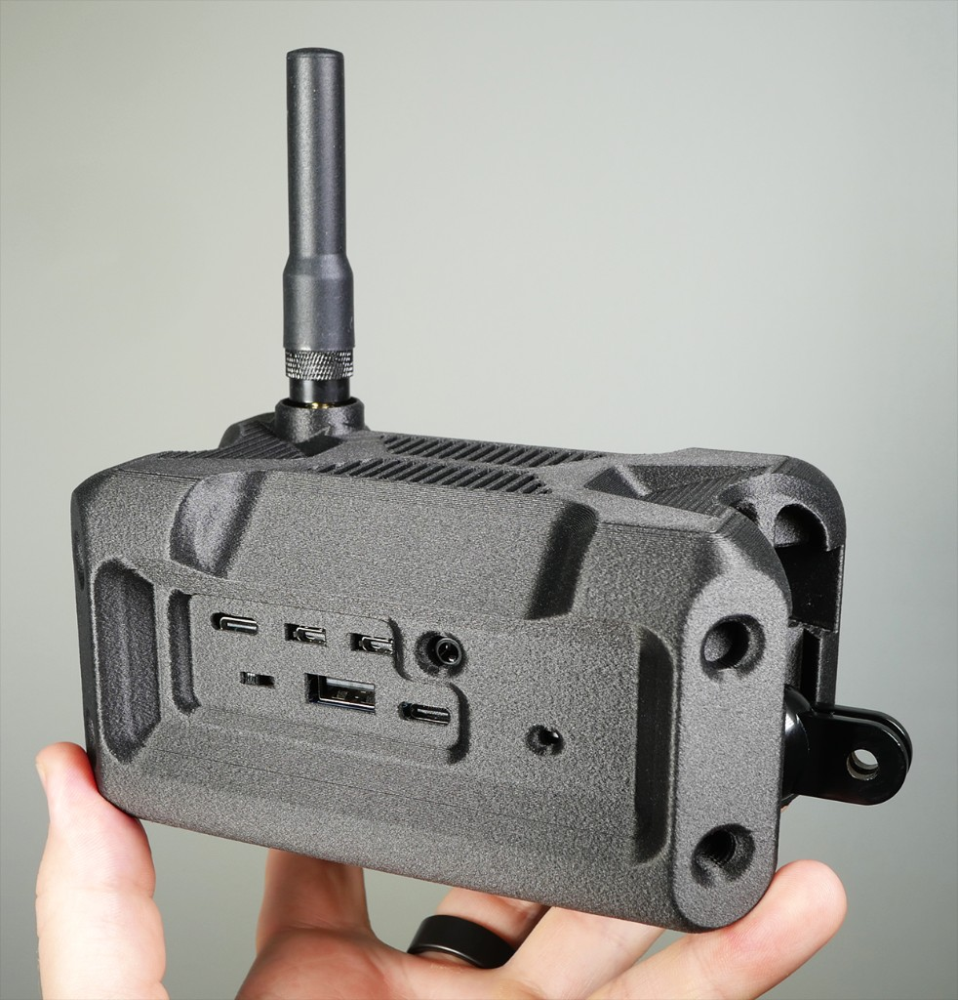
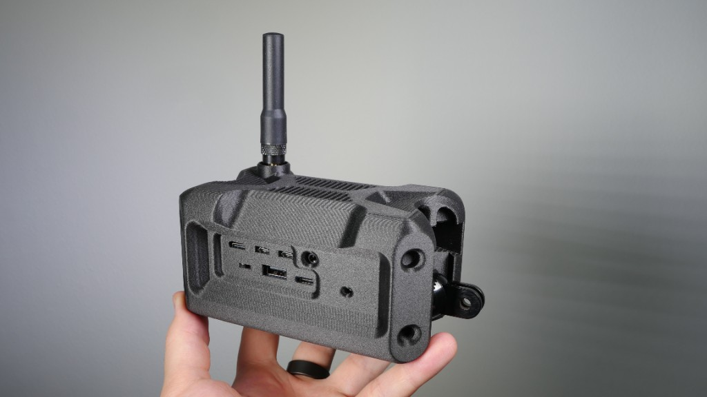
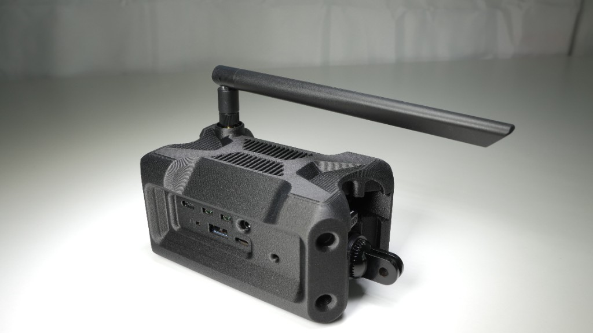

# Haven MANET IP Mesh Radio

Build decentralized, long-range mesh networks with **Haven** - a complete open-source solution for creating self-healing IP networks that share internet access across kilometers without any central infrastructure.

**[Haven Guide](https://buildwithparallel.com/products/haven)** - Video tutorials, schematics, 3D printable enclosures, Discord community, and direct support.

## What is Haven?

Haven is a mesh networking platform that combines:

- **HaLow radios** (802.11ah) operating in sub-1GHz spectrum for multi-kilometer range
- **BATMAN-adv** for automatic Layer 2 mesh routing
- **OpenMANET** firmware (OpenWrt-based) for reliable embedded networking
- **Optional Reticulum** for encrypted overlay communications
- **Optional ATAK/CivTAK** integration for situational awareness

### Why Haven?

| Feature | Benefit |
|---------|---------|
| **Decentralized** | No central server, no single point of failure |
| **Long Range** | 1-10+ km node-to-node with HaLow radios |
| **Self-Healing** | Automatic route discovery and failover |
| **Internet Sharing** | One uplink serves the entire mesh |
| **Fully Open Source** | No proprietary lock-in, audit everything |
| **Multi-hop** | Traffic routes through intermediate nodes |
| **Low Power** | Sub-1GHz radios are power efficient |

## Haven Nodes

Haven nodes are compact, rugged units built for field deployment. Each node includes HaLow (sub-1GHz) and WiFi radios, USB and power ports, and versatile mounting (GoPro-style bracket and bolt holes).



| | | |
|:---:|:---:|:---:|
|  |  |  |
| Handheld | Vehicle deployment | Ports and mounting |

## Network Architecture

```
                              Internet
                                  │
                                  ▼
    ┌─────────────────────────────────────────────────────────┐
    │              HAVEN GATE — green (Gateway)                │
    │                                                         │
    │   ┌─────────┐  ┌─────────┐  ┌─────────┐  ┌─────────┐   │
    │   │  eth0   │  │  HaLow  │  │  5GHz   │  │  2.4GHz │   │
    │   │ uplink  │  │  mesh   │  │   AP    │  │   AP    │   │
    │   └─────────┘  └─────────┘  └─────────┘  └─────────┘   │
    │        │            │            │            │         │
    │        └────────────┴────────────┴────────────┘         │
    │                    br-ahwlan bridge                     │
    │                    IP assigned by openmanetd            │
    │                    DHCP Server                          │
    └─────────────────────────────────────────────────────────┘
                                  │
                                  │ HaLow Sub-1GHz Mesh
                                  │ (1-10+ km range)
                                  ▼
    ┌─────────────────────────────────────────────────────────┐
    │              HAVEN POINT — blue (Extender)               │
    │                                                         │
    │             ┌─────────┐          ┌─────────┐            │
    │             │  HaLow  │          │  5GHz   │            │
    │             │  mesh   │          │   AP    │            │
    │             └─────────┘          └─────────┘            │
    │                  │                    │                 │
    │                  └────────────────────┘                 │
    │                    br-ahwlan bridge                     │
    │                    10.41.x.x/16                         │
    └─────────────────────────────────────────────────────────┘
                                  │
                                  ▼
                           [Mobile Devices]
                          Phones, Laptops, ATAK
```

## Quick Start

### Automated Setup (Recommended)

Run these scripts on fresh OpenMANET installs to configure everything automatically:

**Gate Node — green (first node, has internet):**
```bash
wget -O setup.sh https://raw.githubusercontent.com/buildwithparallel/haven-manet-ip-mesh-radio/main/scripts/setup-haven-gate.sh
sh setup.sh && reboot
```

**Point Node — blue (mesh extender)** — the point node has no internet, so paste the script instead:
1. Open the [raw setup script](https://raw.githubusercontent.com/buildwithparallel/haven-manet-ip-mesh-radio/main/scripts/setup-haven-point.sh) on your computer
2. Select all and copy
3. Paste into the point node's terminal (via LuCI **Services → Terminal** at `http://10.41.254.1`)
4. After the script finishes, type `reboot`

> After setup, use LuCI's web interface to customize passwords, WiFi SSIDs, and other settings. See [Accessing the Web Interface](#accessing-the-web-interface-luci) below.

See [scripts/README.md](scripts/README.md) for detailed options.

### Accessing the Web Interface (LuCI)

After setup and reboot, manage each node through its web interface. Login as `root` with the default password.

> **Note:** OpenMANET dynamically assigns mesh IPs on all nodes. To find any node's current mesh IP, run `uci get network.ahwlan.ipaddr` on that node, or check the boot screen on a connected monitor.

#### Finding Blue (Point) Node IPs from Green (Gate)

The green (gate) node tracks all mesh nodes in its local database. To find blue's IP, SSH into green and run:

```bash
strings /etc/openmanetd/openmanetd.db | grep blue
```

This returns blue's MAC address, hostname, and current mesh IP:
```
2c:c6:82:8a:2a:f6 blue 10.41.126.198
```

Use the IP at the end to access blue's web interface.

**Gate Node (green)** — default password: `havengreen`

| Method | Steps |
|--------|-------|
| Gate WiFi | Connect to **green-5ghz** (password: `green-5ghz`), run `uci get network.ahwlan.ipaddr` on the gate to find its mesh IP, browse to that IP |
| Upstream network | Connect to your upstream router's WiFi, find the gate's IP in your router's device list, browse to that IP |

**Point Node (blue)** — default password: `havenblue`

| Method | Steps |
|--------|-------|
| Point WiFi | Connect to **blue-5ghz** (password: `blue-5ghz`), browse to **http://\<point-mesh-ip\>** |
| Gate WiFi (via mesh) | Connect to **green-5ghz**, browse to **http://\<point-mesh-ip\>** |

> **Tip:** If you can reach the point node's LuCI through the gate node's WiFi, your mesh is working.

### Manual Setup

For manual configuration or custom setups:

1. **Gate Node (green)**: [docs/haven-gate.md](docs/haven-gate.md)
2. **Point Node (blue)**: [docs/haven-point.md](docs/haven-point.md)
3. **Reticulum** (optional): [Reticulum/README.md](Reticulum/README.md)
4. **ATAK Integration** (optional): [ATAK/README.md](ATAK/README.md)

## HaLow (802.11ah) Radio Specifications

HaLow operates in sub-1GHz ISM bands, providing significantly greater range than traditional WiFi.

### Supported Frequency Bands

| Region | Frequency Range | Common Channels |
|--------|-----------------|-----------------|
| US/FCC | 902-928 MHz | 1-51 |
| EU/ETSI | 863-868 MHz | Varies |
| Japan | 920-928 MHz | Varies |
| Australia | 915-928 MHz | Varies |

### Channel Widths

Max PHY rate depends on the HaLow SoC. Haven ships with the **MM6108** (MCS 0–7, 64-QAM max). The **MM8108** adds MCS 8–9 (256-QAM) for higher peak rates and an integrated 26 dBm PA.

| Width | MM6108 Max | MM8108 Max | Range | Use Case |
|-------|------------|------------|-------|----------|
| 1 MHz | 3.3 Mbps | 4.4 Mbps | Maximum | Long-range backhaul |
| 2 MHz | 7.2 Mbps | 8.7 Mbps | Very Long | Balanced |
| 4 MHz | 15.0 Mbps | 20.0 Mbps | Long | Higher throughput |
| 8 MHz | 32.5 Mbps | 43.3 Mbps | Medium | Local high-speed |

> Real-world throughput is typically 40–60% of PHY rate. See [scripts/README.md](scripts/README.md#channel-width-vs-range) for the full MCS reference table.

### Current Configuration
- **Channel**: 28 (916 MHz center frequency)
- **Width**: 2 MHz (HT20)
- **Throughput**: ~32.5 Mbps
- **Encryption**: WPA3 SAE (CCMP)

## Software Stack

All components are open source:

| Component | Version | Description |
|-----------|---------|-------------|
| **OpenMANET** | 24.10 (1.6.1) | OpenWrt-based mesh firmware |
| **OpenWrt** | 24.10 | Base embedded Linux distribution |
| **Linux Kernel** | 6.6.102 | Operating system kernel |
| **Morse Micro Driver** | 1.16.4 | HaLow radio driver |
| **BATMAN-adv** | 2025.4 | Layer 2 mesh routing protocol |
| **Python** | 3.11.14 | Runtime for Reticulum |
| **Reticulum** | 1.1.3 | Encrypted networking stack |

## Hardware Requirements

### Tested Platform
- **SBC**: Raspberry Pi CM4 / Pi 4
- **HaLow Radio**: Morse Micro MM601X (SPI interface)
- **5GHz WiFi**: Cypress CYW43455 (onboard on Pi)
- **2.4GHz WiFi**: RT5370 USB adapter (optional)

### Minimum Requirements
- ARM or x86 device with SPI interface
- HaLow radio module (Morse Micro recommended)
- Standard WiFi for client access

## Documentation

| Document | Description |
|----------|-------------|
| [scripts/README.md](scripts/README.md) | **Automated setup scripts** |
| [docs/haven-gate.md](docs/haven-gate.md) | Gate node (green) manual configuration |
| [docs/haven-point.md](docs/haven-point.md) | Point node (blue) manual configuration |
| [Reticulum/README.md](Reticulum/README.md) | Encrypted communications layer |
| [ATAK/README.md](ATAK/README.md) | ATAK/CivTAK integration |

## Use Cases

- **Disaster Response**: Deploy mesh networks where infrastructure is damaged
- **Remote Operations**: Connect sites across kilometers without internet
- **Events**: Temporary networks for large gatherings
- **Maritime**: Ship-to-ship and ship-to-shore communications
- **Agriculture**: Connect sensors and equipment across large properties
- **Community Networks**: Neighborhood internet sharing

## Security

| Layer | Protection |
|-------|------------|
| HaLow Mesh | WPA3 SAE (CCMP) - strongest WiFi encryption |
| Reticulum | Curve25519 + AES-128 end-to-end encryption |
| ATAK | Optional additional encryption |

## Support & Community

- **[Haven Guide](https://buildwithparallel.com/products/haven)** - Complete build guide with videos
- **Discord** - Join the community (link in Haven Guide)
- **Direct Support** - Available through Parallel

## Contributing

Contributions welcome:
- Hardware compatibility testing
- Documentation improvements
- Bug fixes and features
- Use case examples

## License

MIT License - See [LICENSE](LICENSE) file.

## 3D Printable Enclosure

The official Haven case is released into the **public domain** — free for anyone to print, modify, and distribute. Designed for Parallel by [MOROSX](https://morosx.com/).

[Download on Printables](https://www.printables.com/model/1468595-haven-case-for-raspberry-pi-based-manet-by-paralle)

## Acknowledgments

- [OpenMANET](https://openmanet.org/) - Mesh networking firmware
- [Reticulum](https://reticulum.network/) by Mark Qvist
- [ATAK](https://tak.gov/) by TAK Product Center
- [Morse Micro](https://www.morsemicro.com/) - HaLow radio technology
- [OpenWrt](https://openwrt.org/) Project
- [MOROSX](https://morosx.com/) - Haven enclosure design
- [BATMAN-adv](https://www.open-mesh.org/) mesh protocol
