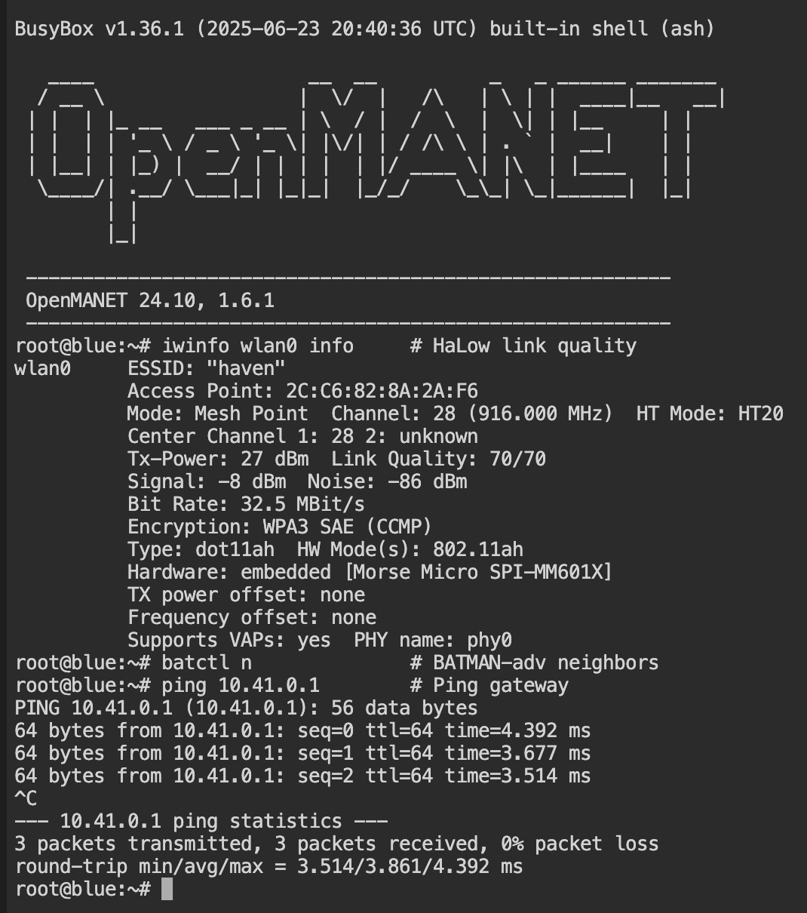

# Haven Setup Guide

Step-by-step instructions for setting up a Haven mesh network.

**[Haven Guide](https://buildwithparallel.com/products/haven)** - Video tutorials, schematics, 3D printable enclosures, Discord community, and direct support.

> **Prerequisite:** All scripts assume each node is flashed with fresh firmware for its hardware.
>
> **Haven 1 / Raspberry Pi 4 or CM4:** Flash a current [OpenMANET](https://openmanet.net/) image.
>
> **Haven 2 / Raspberry Pi 5:** Flash the Pi 5-specific OpenWrt/Morse firmware, not the Haven 1 / Pi 4 OpenMANET image. Build it from [`buildwithparallel/openwrt-morse-rpi5`](https://github.com/buildwithparallel/openwrt-morse-rpi5), or download the prebuilt [v0.3.0-alpha release](https://github.com/buildwithparallel/openwrt-morse-rpi5/releases/tag/v0.3.0-alpha).
>
> **Fresh install:** Flash the correct image onto each node's microSD card using Raspberry Pi Imager, then insert the card and power on.
>
> **Card not wiping cleanly or re-flash looks half-done?** In Raspberry Pi Imager, use the **Erase** option first (in **Choose OS** it is often under **Raspberry Pi OS (other)** or a **Misc** / **utility** section, depending on version; some builds label it as formatting the card). That fully blanks the microSD, then run **Choose OS** → your firmware file / image and **Write** as usual.
>
> **Pro tip (Raspberry Pi 4):** If **Erase** still leaves the card in a bad state, first flash **Raspberry Pi Zero (32-bit)** to the card. That usually clears stubborn cards properly. Then use Imager again to flash your desired final image.
>
> **Upgrading an existing install:** Open LuCI → System → Backup / Flash Firmware → upload the correct image for that node. **Uncheck "Keep settings"** for a clean slate.

## Step 1: Set Up the Gate Node (green)

This is the node that shares internet with the rest of the mesh.

1. **Flash the correct platform firmware** onto a microSD card and insert it into the gate node
2. **Connect the gate to your computer** via Ethernet and power it on
3. **Open LuCI** — go to `http://10.41.254.1` (or the IP shown on the node's boot screen) in your browser. Log in with username `root` and **no password** (leave it blank)
4. **Initial setup screen** — set hostname and password, leave country as **US**, then click **Apply** and wait for the page to reload:
   - **Hostname:** `green`
   - **Password:** `havengreen`
5. **After the page reloads** — go to **Wizards** → click **802.11s Mesh** → select **Mesh Gate** → select **Ethernet** as the upstream network. On the mesh network screen, **leave the Mesh ID, passphrase, and channel settings as-is** — the Haven setup script overwrites them. You can disable the 2.4GHz and 5GHz WiFi radios here — the script reconfigures those too
6. **Plug the gate into your upstream router** via Ethernet
7. **Find the gate's new IP** in your router's device/DHCP table. If it doesn't appear, try powering the Pi off and on again — this forces it to request a new DHCP lease from the router
8. **Open a terminal on the gate** (username: `root`, password: `havengreen`) — pick one:
   - **Browser:** go to `http://<gate-ip>` → **Advanced Config → Services → Terminal**
   - **SSH:** `ssh root@<gate-ip>` from your computer
9. **Run the Haven setup script** (the node now has internet via the router) — paste this and press **Enter**:
   ```bash
   wget -O /tmp/setup.sh "https://raw.githubusercontent.com/buildwithparallel/haven-manet-ip-mesh-radio/main/scripts/node-setup/setup-haven-gate.sh?$(date +%s)" && sh /tmp/setup.sh
   ```
10. The node **reboots automatically** when the script finishes — wait ~60 seconds

### What your gate can do now

- **Gets internet** from any upstream router via Ethernet — home ISP, Starlink, hotel, whatever has a port
- **Broadcasts `green` WiFi** (2.4GHz) — any phone, laptop, or tablet can connect and get internet just like a normal router. Clients get an IP in the `10.41.0.0/16` subnet (e.g. `10.41.0.100`) — this is the Haven mesh address space shared across all nodes and clients
- **Scans for HaLow mesh nodes** — if a point node is in range, BATMAN-adv automatically bridges it into the network so its clients share the same internet and can talk to each other

### Gate Check

1. On your phone, connect to the **`green`** WiFi (password: `greengreen`)
2. Open a browser and confirm you have internet
3. Run a speed test — this is your baseline; point nodes will be slower due to HaLow backhaul
4. Check your phone's network settings — the gateway/router IP shown (e.g. `10.41.0.1`) is the gate's mesh IP; open `http://10.41.0.1` to reach LuCI from the mesh network
5. You can also still reach LuCI from your upstream router's network using the gate's other IP (likely `192.168.x.x`) — useful for admin access without switching WiFi

## Step 2: Add Point Nodes (blue)

Point nodes extend the mesh — no internet connection needed on the point during setup.

1. **Flash the correct platform firmware** onto a microSD card and insert it into the point node
2. **Connect the point to your computer** via Ethernet and power it on
3. **Open LuCI** — go to `http://10.41.254.1` in your browser. Log in with username `root` and **no password** (leave it blank)
4. **Initial setup screen** — set hostname and password, leave country as **US**, then click **Apply** and wait for the page to reload:
   - **Hostname:** `blue`
   - **Password:** `havenblue`
5. **After the page reloads** — go to **Wizards** → click **802.11s Mesh** → select **Mesh Point** → select **Bridge** as the router type. On the mesh network screen, **leave the Mesh ID, passphrase, and channel settings as-is** — the Haven setup script overwrites them. You can disable the 2.4GHz and 5GHz WiFi radios here — the script reconfigures those too
6. After the wizard finishes, the page will reload — the IP may stay the same (`10.41.254.1`), in which case just log back in. If it changed, find the new IP on your Mac: **System Settings → Network → USB/Ethernet adapter → Router** — that IP is the node. On Windows: **Settings → Network → Ethernet → View hardware and connection properties → Default gateway**
7. **Open LuCI at the new IP** (username: `root`, password: `havenblue`) → **Advanced Config → Services → Terminal**
8. In the terminal, type the following and press **Enter**:
   ```sh
   cat > /tmp/setup.sh
   ```
9. On your laptop, open the [point setup script on GitHub](https://github.com/buildwithparallel/haven-manet-ip-mesh-radio/blob/main/scripts/node-setup/setup-haven-point.sh), click the **copy** button (top right of the code block), then paste into the terminal
10. Press **Ctrl+D** to save, then run:
    ```sh
    sh /tmp/setup.sh
    ```
11. The node **reboots automatically** when the script finishes — wait ~60 seconds. Once it's back up you can **unplug the Ethernet** — the point connects to the gate over HaLow from here on

### What your point can do now

- **Connects to the gate** over HaLow (sub-1GHz) — up to several kilometers line of sight, through walls and terrain
- **Broadcasts `blue` WiFi** (2.4GHz) — clients connect and get internet routed back through the gate via BATMAN-adv
- **Self-heals** — if another point node is in range, BATMAN-adv will route around failures automatically
- **No Ethernet needed** — the HaLow link is the only backhaul required

### Point Check

1. On your phone, connect to the **`blue`** WiFi (password: `blueblue`)
2. Open a browser and confirm you have internet
3. Bandwidth here is limited by the HaLow backhaul to the gate — expect lower speeds than on `green` directly, which is normal

### Next Steps: Harden and Expand

Once you've confirmed both nodes are up and internet is flowing through the mesh, do these before relying on it in the field:

- **Change all passwords and SSIDs** — update `root` passwords and WiFi passphrases in LuCI (System → Administration, and Network → Wireless). The defaults exist for easy first-time setup, not security.
- **Add more radios if needed** — additional WiFi adapters (USB or onboard) can be enabled and bridged into `ahwlan` via LuCI → Network → Wireless. The Panda USB + HaLow combination is the most reliable starting point, but the onboard Cypress 5GHz or additional USB adapters can be re-enabled once basic functionality is proven.

### Adding More Nodes

For each additional point node:
1. Edit `setup-haven-point.sh` with unique `HOSTNAME` and `MESH_IP`
2. Keep `MESH_ID`, `MESH_KEY`, `HALOW_CHANNEL` the same as gate
3. Run script and reboot

### Verify the Mesh

1. Connect your phone or laptop to **`green`** WiFi (password: `greengreen`)
2. Check your network settings — the gateway IP shown is the gate; open a terminal there via **`http://<gate-ip>` → Advanced Config → Services → Terminal** or SSH
3. Run on the gate to find blue's IP:
   ```bash
   ip neigh show dev br-ahwlan
   ```
4. Ping blue first, then browse to its LuCI:
   ```bash
   ping <blue-ip>
   ```
5. Open **`http://<blue-ip>`** — if blue's LuCI loads, your mesh is working

For deeper diagnostics, run these on any node:
```bash
iwinfo wlan0 info     # HaLow link quality
batctl n              # BATMAN-adv neighbors
```



> After setup, use LuCI's web interface to change passwords, WiFi SSIDs, and other settings on each node. See [Finding & Accessing Nodes](../reference/finding-nodes.md) to reach each node.
>
> **Something not working?** Run the diagnostic script on the problem node:
> ```bash
> wget -O- https://raw.githubusercontent.com/buildwithparallel/haven-manet-ip-mesh-radio/main/scripts/node-ops/haven-diag.sh | sh
> ```

### Connect Your Device

After setup, connect your computer, phone, or tablet to the Haven network:

1. **Join the node's WiFi** — `green` for the gate, `blue` for a point
   - Gate: `green` / `greengreen`
   - Point: `blue` / `blueblue`
2. **Verify your device got an IP** — you should receive an address in the `10.41.x.x` range
   - **Mac/Linux:** `ifconfig` or `ip addr` — look for `10.41.x.x` on your WiFi interface
   - **Windows:** `ipconfig` — look for `10.41.x.x` under your Wi-Fi adapter
   - **Phone:** Settings → WiFi → tap the connected network to see your IP
3. **Access the node's web interface** — browse to `http://<node-mesh-ip>`
   - Find the mesh IP by running `uci get network.ahwlan.ipaddr` on the node, or check its boot screen

> **Can't see the WiFi network?** See [Troubleshooting → WiFi AP Not Broadcasting](../runbooks/troubleshooting.md#checklist-4--wifi-ap-not-broadcasting).
>
> **Alternative:** If the gate node is plugged into your home router, you can also connect your computer to your **regular home WiFi** and access the gate at the IP shown in your router's device list — no need to switch WiFi networks.

## Step 3: Install Reticulum (optional)

**Recommended (simplest):** do **not** put Reticulum (RNS) on your Haven nodes. Install a Reticulum **app on each device** you care about — e.g. [Sideband](https://github.com/markqvist/Sideband) (iOS/Android) or [MeshChat](https://github.com/liamcottle/reticulum-meshchat) (desktop). Connect each device to the **Haven mesh WiFi**; in the app, turn on **AutoInterface**. The mesh is just a `10.41.x.x` network; your clients find each other the same as on any LAN. This is the path we document first in the [Reticulum README](../../integrations/reticulum/README.md).

**On-node RNS (advanced, optional):** only if you need `rnsd` on a node — e.g. the [ATAK/CoT bridge](../../integrations/atak/README.md), always-on RNS on hardware, or the [demo `rns_*.py` scripts](../../scripts/README.md#reticulum-demo-scripts). Then run on **each** such node:

```bash
wget -O /tmp/setup-reticulum.sh https://raw.githubusercontent.com/buildwithparallel/haven-manet-ip-mesh-radio/main/scripts/optional/setup-reticulum.sh
sh /tmp/setup-reticulum.sh
/etc/init.d/rnsd enable && /etc/init.d/rnsd start
```

See the [Reticulum README](../../integrations/reticulum/README.md) for when to use clients vs nodes, and for on-node config when you do install.

## Step 4: Send Reticulum Messages (Optional)

If you are using only **Sideband, MeshChat,** etc. (Reticulum on your **devices**), you do not need this step on the **nodes** — you already send messages in the app. Skip to [Step 5](#step-5-install-the-atak-bridge-optional) or you are done.

The [demo scripts in `scripts/tools/`](../../scripts/README.md#reticulum-demo-scripts) are for when **RNS is running on a node** — they need [Step 3](#step-3-install-reticulum-optional) with on-node RNS, then:

See [scripts/README.md](../../scripts/README.md) for `rns_status.py`, `rns_send.py`, and `rns_receive.py` usage and example output.

## Step 5: Install the ATAK Bridge (Optional)

Bridges ATAK/CivTAK traffic over Reticulum. The bridge runs **on each node** and expects `rnsd` — you need **on-node** RNS from [Step 3](#step-3-install-reticulum-optional) first (client-only Reticulum is *not* enough for this).

```bash
wget -O /tmp/setup-cot-bridge.sh https://raw.githubusercontent.com/buildwithparallel/haven-manet-ip-mesh-radio/main/scripts/optional/setup-cot-bridge.sh
sh /tmp/setup-cot-bridge.sh
/etc/init.d/cot_bridge enable && /etc/init.d/cot_bridge start
```

See [ATAK README](../../integrations/atak/README.md) for peering, live dashboards, and troubleshooting.

### Verify ATAK Bridge
```bash
tail -f /tmp/bridge.log
```

---

## Configuring Heltec HaLow Nodes (BATMAN-adv)

The `configure-heltec.sh` script sets up [Heltec HaLow](https://heltec.org/project/ht-hd01/) nodes running OpenWrt to join the Haven mesh using BATMAN-adv routing over 802.11s.


This is an alternative to the standard point node setup — use it when your node is a Heltec v2 HaLow board rather than a Raspberry Pi with a HaLow HAT.

**What it does:**

1. Binds the HaLow mesh radio to `bat0` via a `batadv_hardif` interface
2. Disables 802.11s forwarding (BATMAN-adv handles routing instead)
3. Creates `bat0` with BATMAN_V in client gateway mode
4. Bridges `bat0` into `br-ahwlan` with a static mesh IP
5. Connects the local WiFi AP to the mesh bridge so clients get internet
6. Removes conflicting anonymous bridge devices from the default firmware

**Usage:**

1. SSH into the Heltec node: `ssh root@10.42.0.1`
2. Edit the configuration variables at the top of the script (`HOSTNAME`, `MESH_IP`, etc.) for your node
3. Paste the script into the terminal and run it
4. Reboot: `reboot`

```bash
# Configuration variables to set per-node:
HOSTNAME="heltec-4"
MESH_IP="10.41.0.4"
MESH_NETMASK="255.255.0.0"
GATEWAY_IP="10.41.0.3"
```

After reboot, the node is reachable at `MESH_IP` on the mesh network.

> **Note:** The Heltec default firmware ships with an anonymous bridge device for `br-ahwlan` that conflicts with BATMAN-adv. The script automatically detects and removes these before creating the correct bridge configuration.

---

## Default Credentials

All nodes use `root` as the username.

| Node | Password | WiFi SSID | WiFi Password |
|------|----------|-----------|---------------|
| Gate (green) | `havengreen` | `green` | `greengreen` |
| Point (blue) | `havenblue` | `blue` | `blueblue` |
| Heltec | `heltec.org` | varies | varies |

---

## Configuration Reference

### Gate Node Defaults (green)

| Setting | Default | Description |
|---------|---------|-------------|
| `HOSTNAME` | green | Node hostname |
| `ROOT_PASSWORD` | havengreen | SSH/LuCI password |
| `MESH_ID` | haven | Mesh network name |
| `MESH_KEY` | havenmesh | Mesh encryption key |
| `MESH_IP` | 10.41.0.1 | Initial node IP (openmanetd may reassign) |
| `HALOW_CHANNEL` | 28 | HaLow channel (916 MHz) |
| `HALOW_HTMODE` | HT80 | Channel width (8 MHz) |

### Point Node Defaults (blue)

| Setting | Default | Description |
|---------|---------|-------------|
| `HOSTNAME` | blue | Node hostname |
| `ROOT_PASSWORD` | havenblue | SSH/LuCI password |
| `MESH_IP` | 10.41.0.2 | Initial node IP (openmanetd may reassign) |
| `GATEWAY_IP` | 10.41.0.1 | Initial gate node IP (openmanetd may reassign) |

> **Note:** OpenMANET's address reservation system manages mesh IPs on all nodes after setup. The defaults above are initial values — the final IPs may differ. Run `uci get network.ahwlan.ipaddr` on any node to find its current mesh IP, or check the boot screen on a connected monitor. To discover the IPs of all mesh nodes from any node, run:
> ```
> strings /etc/openmanetd/openmanetd.db
> ```
> This prints each node's MAC address, hostname, and current mesh IP.
