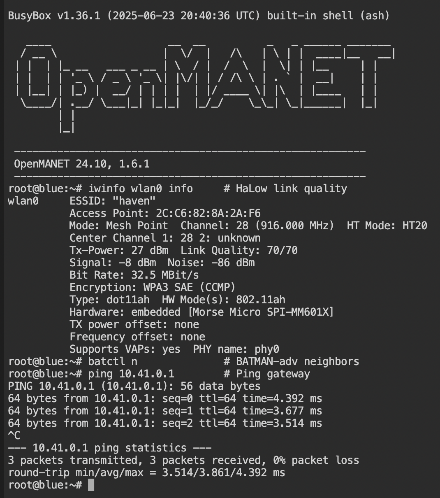

# Haven Setup Scripts

Automated setup scripts for configuring Haven mesh nodes from a fresh OpenMANET install.

**Full Haven Guide**: [buildwithparallel.com/products/haven](https://buildwithparallel.com/products/haven) - includes videos, schematics, 3D printable enclosures, Discord community, and direct support.

## Scripts Overview

| Script | Purpose | Run On |
|--------|---------|--------|
| `setup-haven-gate.sh` | Configure gateway node (internet uplink) | First node |
| `setup-haven-point.sh` | Configure extender node | Additional nodes |
| `setup-reticulum.sh` | Install encrypted mesh overlay | Any node (optional) |
| `setup-cot-bridge.sh` | Install ATAK/CivTAK bridge | Any node (optional) |
| `rns_status.py` | Live Reticulum + HaLow network dashboard | Any node |
| `rns_send.py` | Send a message over Reticulum | Sender node |
| `rns_receive.py` | Receive messages over Reticulum | Receiver node |

## Quick Start

### Step 1: Install OpenMANET

**Fresh install:** Flash OpenMANET onto each node's microSD card using Raspberry Pi Imager, then insert the card and power on.

**Upgrading an existing install:** Open LuCI → System → Backup / Flash Firmware → upload the OpenMANET image. **Uncheck "Keep settings"** for a clean slate.

### Step 2: Set Up the Gate Node (green)

This is the node that shares internet with the rest of the mesh.

1. Plug the gate node into your **upstream router via Ethernet**
2. Find the gate's IP address in your **router's device list**
3. Open a terminal on the gate — pick one:
   - **SSH:** `ssh root@<gate-ip>` from your computer
   - **Browser:** go to `http://<gate-ip>` → **Services → Terminal**
4. Run the setup script:
```bash
wget -O setup.sh https://raw.githubusercontent.com/buildwithparallel/haven-manet-ip-mesh-radio/main/scripts/setup-haven-gate.sh
sh setup.sh && reboot
```
5. Wait ~60 seconds for reboot

### Step 3: Set Up the Point Node (blue)

This node extends the mesh — no internet connection needed.

1. Plug Ethernet **directly from your computer to the point node**
2. Open a browser and go to `http://10.41.254.1`
3. Go to **Services → Terminal**
4. The point node has no internet, so you'll need to paste the script:
   - On your computer, open the [raw setup script](https://raw.githubusercontent.com/buildwithparallel/haven-manet-ip-mesh-radio/main/scripts/setup-haven-point.sh) in a browser tab
   - Select all and copy
   - Paste into the point node's terminal and press Enter
5. After the script finishes, type `reboot` and press Enter
6. Wait ~60 seconds for reboot

### Step 4: Verify the Mesh

1. Connect to **green-5ghz** WiFi (password: `green-5ghz`)
2. Find the point node's mesh IP (run `uci get network.ahwlan.ipaddr` on the point node, or check its boot screen)
3. Browse to **http://\<point-mesh-ip\>** — if blue's LuCI loads, your mesh is working

### Step 5: Customize

Use LuCI's web interface to change passwords, WiFi SSIDs, and other settings on each node. See [Accessing the Web Interface](#accessing-the-web-interface-luci) below.

### 3. (Optional) Add Reticulum Encryption

```bash
wget -O /tmp/setup-reticulum.sh https://raw.githubusercontent.com/buildwithparallel/haven-manet-ip-mesh-radio/main/scripts/setup-reticulum.sh
sh /tmp/setup-reticulum.sh
/etc/init.d/rnsd enable && /etc/init.d/rnsd start
```

### 4. (Optional) Add ATAK Bridge

```bash
wget -O /tmp/setup-cot-bridge.sh https://raw.githubusercontent.com/buildwithparallel/haven-manet-ip-mesh-radio/main/scripts/setup-cot-bridge.sh
sh /tmp/setup-cot-bridge.sh
/etc/init.d/cot_bridge enable && /etc/init.d/cot_bridge start
```

## Configuration Reference

### Gate Node Defaults (green)

| Setting | Default | Description |
|---------|---------|-------------|
| `HOSTNAME` | green | Node hostname |
| `ROOT_PASSWORD` | havengreen | SSH/LuCI password |
| `MESH_ID` | haven | Mesh network name |
| `MESH_KEY` | havenmesh | Mesh encryption key |
| `MESH_IP` | 10.41.0.1 | Initial node IP (openmanetd may reassign) |
| `HALOW_CHANNEL` | 28 | HaLow channel (916 MHz) |
| `HALOW_HTMODE` | HT20 | Channel width (2 MHz) |

### Point Node Defaults (blue)

| Setting | Default | Description |
|---------|---------|-------------|
| `HOSTNAME` | blue | Node hostname |
| `ROOT_PASSWORD` | havenblue | SSH/LuCI password |
| `MESH_IP` | 10.41.0.2 | Initial node IP (openmanetd may reassign) |
| `GATEWAY_IP` | 10.41.0.1 | Initial gate node IP (openmanetd may reassign) |

> **Note:** OpenMANET's address reservation system manages mesh IPs on all nodes after setup. The defaults above are initial values — the final IPs may differ. Run `uci get network.ahwlan.ipaddr` on any node to find its current mesh IP, or check the boot screen on a connected monitor.

### HaLow Channel Selection

| Region | Frequency Range | Example |
|--------|-----------------|---------|
| US/FCC | 902-928 MHz | Channel 28 = 916 MHz |
| EU/ETSI | 863-868 MHz | Region-specific |
| Japan | 920-928 MHz | Region-specific |
| Australia | 915-928 MHz | Region-specific |

### Channel Width vs Range

| Setting | Width | Speed | Range |
|---------|-------|-------|-------|
| HT10 | 1 MHz | ~1.5 Mbps | Maximum |
| HT20 | 2 MHz | ~4 Mbps | Very Long |
| HT40 | 4 MHz | ~15 Mbps | Long |
| HT80 | 8 MHz | ~32 Mbps | Medium |

## Accessing the Web Interface (LuCI)

After setup and reboot, you can manage each node through its web interface.

> **Finding mesh IPs:** OpenMANET dynamically assigns mesh IPs on all nodes. Run `uci get network.ahwlan.ipaddr` on any node to find its current IP, or check the boot screen on a connected monitor.

#### Finding Blue (Point) Node IPs from Green (Gate)

SSH into green (gate) and run:

```bash
strings /etc/openmanetd/openmanetd.db | grep blue
```

This returns blue's MAC address, hostname, and current mesh IP:
```
2c:c6:82:8a:2a:f6 blue 10.41.126.198
```

Use the IP at the end to access blue's web interface.

**Gate Node (green)** — default password: `havengreen`

| Method | Steps |
|--------|-------|
| Gate WiFi | Connect to **green-5ghz** (password: `green-5ghz`), browse to **http://\<gate-mesh-ip\>** |
| Upstream network | Connect to your upstream router's WiFi, find the gate's IP in your router's device list, browse to that IP |

**Point Node (blue)** — default password: `havenblue`

| Method | Steps |
|--------|-------|
| Point WiFi | Connect to **blue-5ghz** (password: `blue-5ghz`), browse to **http://\<point-mesh-ip\>** |
| Gate WiFi (via mesh) | Connect to **green-5ghz**, browse to **http://\<point-mesh-ip\>** |

> **Tip:** If you can reach the point node's LuCI through the gate node's WiFi, your mesh is working.

## After Setup

### Verify Mesh Connectivity
```bash
iwinfo wlan0 info     # HaLow link quality
batctl n              # BATMAN-adv neighbors
ping <gate-mesh-ip>   # Ping gateway (find with: uci get network.ahwlan.ipaddr on the gate)
```



### Verify Reticulum (if installed)
```bash
rnstatus                          # Built-in status (basic)
python3 /root/rns_status.py       # Live dashboard with HaLow + data exchange
```

### Verify ATAK Bridge (if installed)
```bash
tail -f /tmp/bridge.log
```

## Adding More Nodes

For each additional point node:
1. Edit `setup-haven-point.sh` with unique `HOSTNAME` and `MESH_IP`
2. Keep `MESH_ID`, `MESH_KEY`, `HALOW_CHANNEL` the same as gate
3. Run script and reboot

## Troubleshooting

See the [Haven Guide](https://buildwithparallel.com/products/haven) for video tutorials and Discord support.

### Nodes Can't Connect
- Verify `MESH_ID`, `MESH_KEY`, `HALOW_CHANNEL` match exactly on all nodes
- Check HaLow radio: `iwinfo wlan0 info`

### No Internet on Point Nodes
- Verify gateway route: `ip route | grep default`
- Test: `ping <gate-mesh-ip>` then `ping 8.8.8.8`

### Reticulum Issues
- Check status: `rnstatus`
- Live dashboard: `python3 /root/rns_status.py`
- View logs: `rnsd -v`

---

## Reticulum Demo Tools

Three scripts for demonstrating and monitoring Reticulum data transfer over the Haven mesh.

### rns_status.py — Live Network Dashboard

A live-refreshing dashboard showing Reticulum network status, HaLow radio details, configured interfaces, and real-time data exchange with PING/PONG between nodes. Refreshes every 3 seconds.

**Deploy to a node:**
```bash
scp scripts/rns_status.py root@<node_ip>:/root/rns_status.py
```

**Usage:**
```bash
# Standalone mode (listen only, no outbound link)
python3 /root/rns_status.py

# Peered mode (connect to another node running rns_status.py)
python3 /root/rns_status.py <peer_destination_hash>
```

**Two-node setup:**
1. Start on the first node (BLUE) with no arguments — note the destination hash it prints
2. Start on the second node (GREEN) with BLUE's hash — it connects and begins exchanging PING/PONG

```bash
# On BLUE (listener)
python3 /root/rns_status.py

# On GREEN (initiator) — use BLUE's hash from step 1
python3 /root/rns_status.py b9b2bef4bf0510882bcd394469c20928
```

**Example output — standalone (before peering):**
```
  Reticulum Network Status — green
  ======================================================
  Version         : RNS 0.9.3
  Node hash       : ca6fafa5fe557c2f1a86807ee129671c
  Status          : Waiting for peers...

  Radio Transport Layer
  ------------------------------------------------------
    Hardware      : Morse Micro MM6108 802.11ah (HaLow)
    Mode          : Mesh Point
    Mesh ID       : haven
    Frequency     : 916.0 MHz
    Channel       : 28
    Bit Rate      : 32.5 MBit/s
    Signal        : -6 dBm
    Encryption    : WPA3 SAE (CCMP)

  Reticulum Interfaces
  ------------------------------------------------------
    [HaLow Mesh Bridge]
      Type        : AutoInterface
      Device      : br-ahwlan
    [UDP Broadcast]
      Type        : UDPInterface
      Listen      : 10.41.0.1:4242
      Forward     : 10.41.255.255:4242

  Data Exchange
  ------------------------------------------------------
    Packets TX    : 0
    Packets RX    : 0
    Peers         : Discovering...

  ──────────────────────────────────────────────────────
  Refreshing every 3s — Ctrl+C to exit
```

**Example output — linked (active data exchange):**
```
  Reticulum Network Status — green
  ======================================================
  Version         : RNS 0.9.3
  Node hash       : ca6fafa5fe557c2f1a86807ee129671c
  Status          : Linked with blue

  Radio Transport Layer
  ------------------------------------------------------
    Hardware      : Morse Micro MM6108 802.11ah (HaLow)
    Mode          : Mesh Point
    Mesh ID       : haven
    Frequency     : 916.0 MHz
    Channel       : 28
    Bit Rate      : 32.5 MBit/s
    Signal        : -6 dBm
    Encryption    : WPA3 SAE (CCMP)

  Reticulum Interfaces
  ------------------------------------------------------
    [HaLow Mesh Bridge]
      Type        : AutoInterface
      Device      : br-ahwlan
    [UDP Broadcast]
      Type        : UDPInterface
      Listen      : 10.41.0.1:4242
      Forward     : 10.41.255.255:4242

  Data Exchange
  ------------------------------------------------------
    Packets TX    : 42
    Packets RX    : 43
    Peer [blue]   : RTT 23.4ms  (alive)

  ──────────────────────────────────────────────────────
  Refreshing every 3s — Ctrl+C to exit
```

### rns_send.py / rns_receive.py — Message Transfer Demo

Simple sender/receiver pair for demonstrating Reticulum message delivery across the mesh.

**Deploy to nodes:**
```bash
scp scripts/rns_receive.py root@<receiver_ip>:/root/rns_receive.py
scp scripts/rns_send.py root@<sender_ip>:/root/rns_send.py
```

**Usage:**
```bash
# On the receiver node — note the destination hash
python3 /root/rns_receive.py

# On the sender node — use the receiver's hash
python3 /root/rns_send.py <dest_hash> Hello from GREEN over Reticulum and HaLow
```

**Example — receiver:**
```
Listening...
Destination hash: a1b2c3d4e5f6a7b8c9d0e1f2a3b4c5d6
Link established!

>>> Hello from GREEN over Reticulum and HaLow
```

**Example — sender:**
```
Resolving path...
Connecting...
Sending: Hello from GREEN over Reticulum and HaLow
Sent!
```
